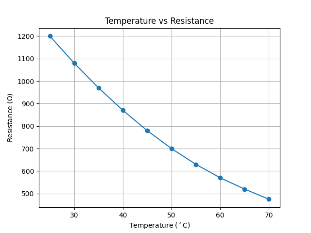

# Temperature-Dependent Resistance Analysis

## Project Overview

This project analyzes the relationship between **temperature and electrical resistance** using Python.

The program reads temperature and resistance data from a CSV file, displays the experimental data, and creates a graph showing how electrical resistance changes with temperature.

## Objectives

* Read experimental data from a CSV file
* Extract temperature and resistance values
* Display the experimental data
* Plot temperature versus resistance
* Visualize the temperature-dependent behavior of electrical resistance

## Technologies Used

* **Python**
* **Pandas**
* **Matplotlib**

## Project Structure

```text
temperature_dependent_characteristic/
│
├── outputs/
│   └── Figure_1.png
│
├── main.py
├── README.md
└── temperature_resistance.csv
```

## Dataset

The dataset is stored in `temperature_resistance.csv` and contains two main columns:

| Column           | Description                         |
| ---------------- | ----------------------------------- |
| `Temperature_C`  | Temperature in degrees Celsius (°C) |
| `Resistance_Ohm` | Electrical resistance in ohms (Ω)   |

## Analysis

The program performs the following steps:

1. Loads the CSV file using Pandas.
2. Extracts the temperature data.
3. Extracts the resistance data.
4. Displays the experimental dataset.
5. Plots temperature versus resistance.
6. Saves the resulting graph in the `outputs` folder.

### Loading the Data

The CSV file is loaded using Pandas:

```python
data = pd.read_csv("temperature_resistance.csv")

T = data["Temperature_C"]
R = data["Resistance_Ohm"]
```

### Plotting the Data

The temperature and resistance values are plotted using Matplotlib:

```python
plt.plot(T, R, 'o-')
```

The graph contains:

* **X-axis:** Temperature (°C)
* **Y-axis:** Resistance (Ω)

## Output

### Temperature vs Resistance

The following graph shows the relationship between temperature and electrical resistance.



## Result

The graph provides a visual representation of how the **electrical resistance changes with temperature**.

This type of analysis is useful for studying the temperature-dependent electrical behavior of materials.

## How to Run

### 1. Install Python

Make sure Python is installed on your computer.

### 2. Install Required Libraries

Open a terminal in the project directory and run:

```bash
pip install pandas matplotlib
```

### 3. Run the Program

Execute the Python script:

```bash
python main.py
```

The program will read the data from `temperature_resistance.csv` and generate the temperature-versus-resistance plot.

## Conclusion

This project demonstrates a simple Python-based approach to analyzing **temperature-dependent resistance data**.

It provides practical experience with:

* Reading CSV files
* Data handling using Pandas
* Extracting data from columns
* Data visualization
* Scientific plotting using Matplotlib
* Analyzing experimental data

## Future Improvements

The project can be further improved by adding:

* Calculation of the **temperature coefficient of resistance**
* Trendline or curve fitting
* Percentage change in resistance
* Comparison between experimental and theoretical results
* Analysis of different materials
* Calculation of statistical parameters
* Automatic identification of important features in the data

## Author

**MST. SANJIDA AKTER**
